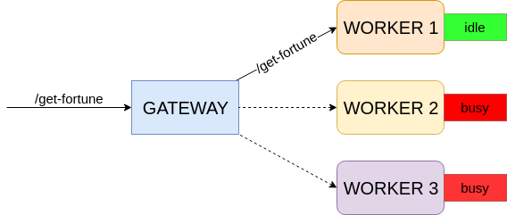

# Problem

There is an existing HTTP service. The service exposes a single endpoint `GET /get-fortune`.

Three instances of this service should be able to start locally using the following Docker Compose command:

`docker compose up -d`

But there is a problem with this service: each service instance can only handle one request at a time, and just rejects exceeding requests.

## Objective

An HTTP gateway service for the aforementioned service instances should be implemented. This gateway service should do the following:

1. It should act as a proxy/load-balancer for the service instances behind it. I.e. it should expose the same `GET /get-fortune`
endpoint that must return responses received upon forwarding requests to one of the worker instances behind it.

2. It should handle gracefully bursts in the load by buffering requests and then forwarding them further when there is an idle
worker instance (i.e. it shouldn't send requests to busy workers). So even if there are only 3 worker instances,
the gateway should be able to process 5 simultaneous requests without failures.

Schematically the architecture looks like this:

